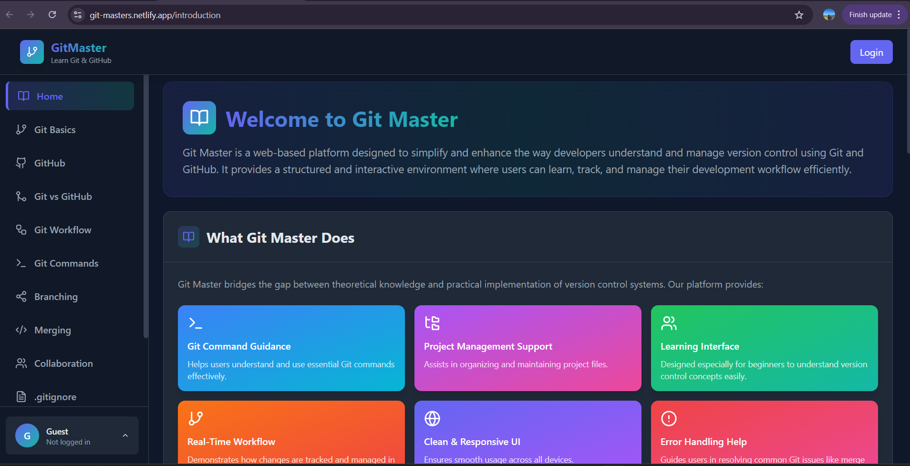

# GitMaster - Learn Git & GitHub 🚀

A modern, interactive web platform designed to help developers master Git and GitHub through structured lessons, interactive quizzes, and hands-on examples.

## ✨ Features

### 📚 Comprehensive Learning Sections
- **Introduction** - Overview of Git & GitHub importance
- **Git Basics** - Core concepts, installation, and fundamentals
- **GitHub** - Platform features and collaboration tools
- **Git vs GitHub** - Detailed comparison table
- **Git Workflow** - Step-by-step workflow with visual diagrams
- **Git Commands** - 10 essential commands with examples
- **Branching** - Branch management and strategies
- **Merging** - Merge concepts and conflict resolution
- **Collaboration** - Team workflows and Pull Requests
- **.gitignore** - File ignoring patterns and best practices
- **Undo & Recovery** - Recovery commands and safety warnings
- **Quiz** - 20 interactive questions with scoring

### 🎯 Interactive Features
- **Authentication System** - Login, Signup, Forgot Password
- **User Profiles** - Personalized user experience
- **Interactive Quiz** - 20 questions (Easy → Hard) with immediate feedback
- **Progress Tracking** - Track answered questions and quiz scores
- **Score Breakdown** - Performance analysis by difficulty level

### 🎨 Modern UI/UX
- **Dark Dashboard Theme** - Professional and modern design
- **Responsive Layout** - Works on mobile, tablet, and desktop
- **Smooth Animations** - Framer Motion transitions
- **Terminal-style Code Blocks** - Authentic coding experience
- **Gradient Cards** - Visually appealing content cards

## 🛠️ Tech Stack

| Technology | Version | Purpose |
|------------|---------|---------|
| React | 18.2.0 | Frontend framework |
| Vite | 5.0.8 | Build tool |
| Tailwind CSS | 3.3.6 | Styling |
| React Router DOM | 6.20.0 | Navigation |
| Framer Motion | 10.16.16 | Animations |
| Lucide React | 0.294.0 | Icons |

💻 Usage
Authentication
Login: Use any email/password (demo authentication)

Signup: Create a new account with name, email, password

Guest Mode: Browse without logging in

Navigation
Sidebar: Click any section to navigate

Mobile: Tap the hamburger menu to open sidebar

Profile: Click avatar at bottom of sidebar for account options

Learning Path
Start with Introduction to understand basics

Learn Git Basics for fundamentals

Explore GitHub platform features

Compare Git vs GitHub

Understand Git Workflow

Memorize Git Commands

Master Branching & Merging

Practice Collaboration

Learn about .gitignore

Study Undo & Recovery

Test knowledge with Quiz

📚 Sections Overview
Section	Description	Key Topics
Introduction	Platform overview	Why Git & GitHub matter
Git Basics	Core concepts	VCS, Repository, Commits
GitHub	Cloud platform	Remote repos, Collaboration
Git vs GitHub	Comparison	Differences, Use cases
Git Workflow	Process flow	Working → Staging → Local → Remote
Git Commands	Command reference	init, clone, add, commit, push, pull, branch, checkout, merge
Branching	Branch management	Create, switch, merge branches
Merging	Combine changes	Fast-forward, 3-way, Conflicts
Collaboration	Team workflow	PRs, Code review, Issues
.gitignore	File ignoring	Patterns, Best practices
Undo & Recovery	Recovery commands	restore, reset, rm
Quiz	Knowledge test	20 questions with scoring
📝 Quiz Details
Question Distribution
Easy Questions (1-5): Basic Git commands and concepts

Medium Questions (6-12): Workflow and collaboration

Hard Questions (13-20): Advanced Git operations

Quiz Features
✅ 20 multiple-choice questions

✅ Immediate feedback after each answer

✅ No second chances (answers are locked)

✅ Progress tracking

✅ Score calculation with percentage

✅ Performance breakdown by difficulty

✅ Detailed explanations for correct answers

  
   
  <em>GitMaster Learning Platform </em>

Project Link: https://git-masters.netlify.app/

